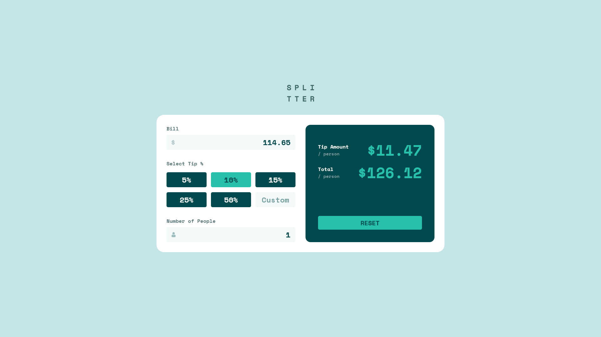

# Frontend Mentor - Tip calculator app solution

This is a solution to the [Tip calculator app challenge on Frontend Mentor](https://www.frontendmentor.io/challenges/tip-calculator-app-ugJNGbJUX). Frontend Mentor challenges help you improve your coding skills by building realistic projects.

## Table of contents

- [Overview](#overview)
  - [The challenge](#the-challenge)
  - [Screenshot](#screenshot)
  - [Links](#links)
- [My process](#my-process)
  - [Built with](#built-with)
  - [What I Learned](#what-i-learned)
  - [Useful resources](#useful-resources)
- [Author](#author)

## Overview

### The challenge

Users should be able to:

- View the optimal layout for the app depending on their device's screen size
- See hover states for all interactive elements on the page
- Calculate the correct tip and total cost of the bill per person

### Screenshot

### Links

- Solution URL: [Add solution URL here](https://your-solution-url.com)
- Live Site URL: [Add live site URL here](https://your-live-site-url.com)

## My process

### Built with

- Semantic HTML5 markup
- CSS custom properties
- Flexbox
- CSS Grid
- Mobile-first workflow
- [Svelte/SvelteKit][svelteweb]
- [Tailwind CSS][tailwinddocs]

### What I Learned

I haven't really used the `$derived` rune a ton since the release of Svelte 5, so using it to create reactive state for the totals for this project was something I learned while completing this project.

I also learned about the better practice of radio buttons while completing this project. I originally built this page to use regular HTML buttons in the form, but I learned that radio buttons are better semantically and for accessibility, so I refactored to using radio buttons for the tip selections within the form, even though the form isn't submitted or sent to an action.

### Useful resources

- [Svelte/SvelteKit Docs][svelteweb]
- [Tailwind CSS Docs][tailwinddocs]

## Author

- Website - [JYLN](https://jyln.dev)
- Frontend Mentor - [@JYLN](https://www.frontendmentor.io/profile/JYLN)

[tailwinddocs]: https://tailwindcss.com/docs
[svelteweb]: https://svelte.dev/
